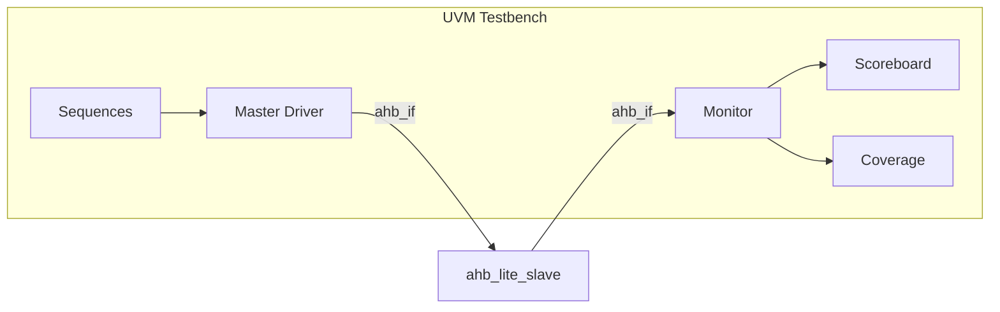

# AHB-Lite UVM Design Verification Flow

## Architecture



| Layer | Path | Role |
|-------|------|------|
| RTL DUT | `rtl/ahb_lite_slave.sv` | 4 KB AHB-Lite SRAM slave |
| Interface | `tb/interfaces/ahb_if.sv` | Bus signaling + clocking blocks |
| Agent | `tb/agents/` | Active master (driver/sequencer/monitor) |
| Env | `tb/env/` | Scoreboard memory model + functional coverage |
| Tests | `tb/tests/` | Directed + random scenarios |
| Top | `tb/tb_top.sv` | Clock/reset, DUT hookup, `run_test()` |

## Tests

| Test | Description |
|------|-------------|
| `ahb_smoke_test` | Single word write/read @0x100 |
| `ahb_burst_test` | INCR4 burst write + readback |
| `ahb_random_test` | 16 random single transfers |
| `ahb_error_test` | Read above memory map (expects ERROR) |

## Run (Questa / ModelSim)

1. Install [Questa](https://www.intel.com/content/www/us/en/software/programmable/questa.html) or ModelSim and add `vlog`/`vsim` to `PATH`.
2. Set `QUESTA_HOME` (optional; Makefile falls back to a default path).

```powershell
cd sim
.\run.ps1 -Test ahb_smoke_test
.\regression.ps1
```

Or with GNU Make:

```bash
cd sim
make run TEST=ahb_smoke_test
make regress
```

## Checks

- **Scoreboard**: software memory model; compares read data vs prior writes.
- **Coverage**: HTRANS, read/write, HSIZE, HBURST, address bins, crosses.
- **Protocol**: driver enforces IDLE between bursts; NONSEQ/SEQ for INCR4.

## Artifacts

- Simulation logs: `sim/logs/<test>.log`
- Work library: `sim/work/`

## Extending

- Add slaves/arbiters under `rtl/` and passive agents in `tb/agents/`.
- Raise `DUT_WAIT` via `make run DUT_WAIT=2` for wait-state stress.
- Plug regression into CI once `vlog`/`vsim` are on the runner image.
